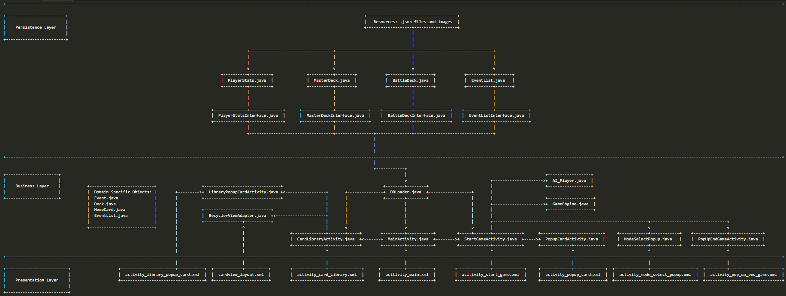

# Architecture
This application follow a simple 3-tier architecture which consists of the presentation layer, business logic layer, and persistence layer.

## Presentation Layer
The presentation layer is represented by the `.xml` files in the `layout` directory. The main pages are:
- Home Page
    - Start page of the app. From here, players can navigate to the card library, start a battle, or exit the game. This is a page with static content.
- Card Library Page 
    - This is where players can view all the cards that they have unlocked or collected. Player can also look at information for each card by clicking on the card. Not much logic happens here but the database is accessed to display progress and retrieved card information.
- Battle Page
    - This is the gameplay page of the application where the player go to do card battle. This is also where most of the application logic happens. The database is only accessed at the start of the gameplay to retrieve battle cards.

## Business Layer
Most of the business logic in this application happens in the Battle Page where it controls the gameplay. Major components include:
- Battle Deck
    - This object keeps track of the state of a players battle deck. A deck contains cards and both the human players and AI player will each have a deck of their own.
- AI player
    - This is the opponent that the player will be playing against. The AI player has its own deck and can be configured to different dificulty levels.
- Game Engine
    - This controls the game play and keep track of the game state. Inputs from the player (card selection) is received, then the AI player's response is generated, and finally the results of the match is calculated and presented.

## Persistance Layer
This is where all the databases and interface to the databases sits. A single database with multiple tables is used. Each table has its own unique interace disigned for it for easy and intuitive access. Below are the tables:
- Master Deck
    - This table stores all the cards that exist in the game. Metadata about the cards such as whether or not the card is unlocked is tracked as well.
- Battle Deck
    - This is the human player's active battle deck. This deck can be modified by the player and modifications will persist until changes are made again.
- Event List
    - Each battle round is associated with an event and this table stores information about all events.
- Player Stats
    - This table store information and progress about the player such as in-game currency

## Architecture Diagram

