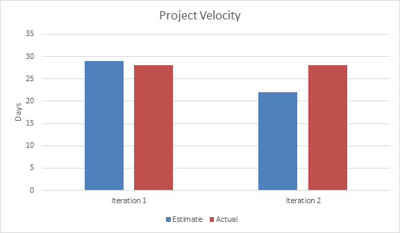

# Retrospective
Iteration 2 gave our group quite a few challenges overall such as implementing new funtionalities, merging different members' work together, etc. but the biggest issue was the lack of testing in the duration of the iteration. Without thorough testing, the app unexpectedly came up with a few bugs that could have been avoided easily. Fortunately, we were able to find and debug all of the bugs that we know of, however, had we found the bugs earlier with proper testing, we could have done a better job debugging and perhaps even find more bugs.

For iteration 3, we want our app to be completely bug-free by at least a day before the end of the iteration which can be achieved through more extensive testing and other measures. We will still individually write unit tests for any new functionality that we implement as we have been doing so far, but we must also run existing integration tests, system tests before we push any changes. This will ensure that the tests are doing what they're meant to do which is to guarantee that the unit works and that it works with the rest of the app. We will also move our deadline to 1 day before the release as a measure to help us manage time. This gives us a comfortable duration of time that we could use to resolve any unforeseeable issues or to debug. As an experiment, we want to merge more frequently with the develop branch, while still maintaining strict code reviews on merge requests by other members, so that all members can get the latest change earlier to catch any potential conflict as soon as possible. Ideally, we want to send a merge request after any single unit is fully completed and tested. This is opposed to what we have been doing which is merging everyone's branches at the end of the iteration which at times did result in bugs that had to be fixed in a short amount of time. During iteration 2, due to certain features being too big and thus had to be worked on by more than one member, bugs were generated after merging and resolving the conflicts that naturally happen when more than one person work on the same file. Unfortunately, this is hard to avoid without heavily compromising productivity and might even lead to features not being delivered so we are still choosing to continue this practice. We do not have a solution for this particular source of bugs but with the time cushion before the actual deadline, we are confident that we can have a product ready for release well before the deadline.

We aim to have a merged product one day before the actual deadline to leave room for debugging. The effectiveness of the above solutions to our problem will be measured by simply comparing the count of bugs remaining on the day of the release of iteration 3 with that of iteration 2. If we find that there are fewer bugs, it would be a success. 

# Project Velocity
The chart below shows the project velocity from iterations 1 and 2.

